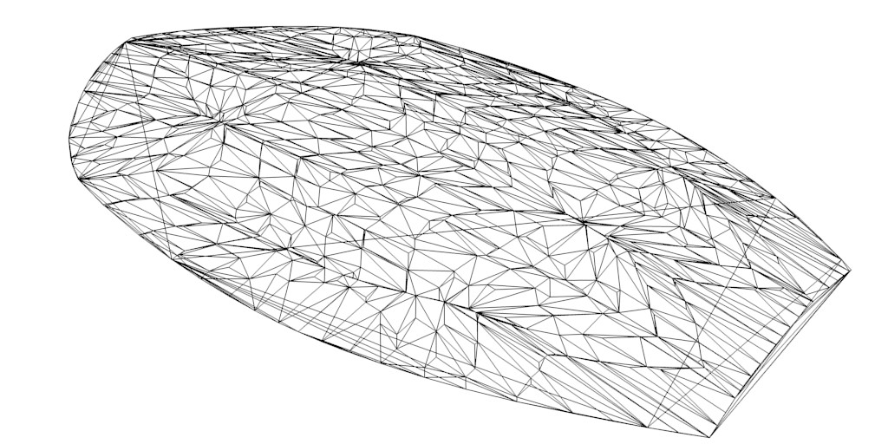
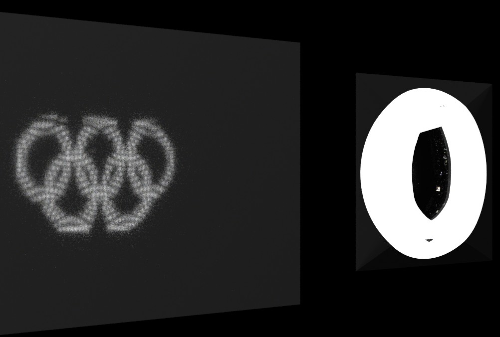
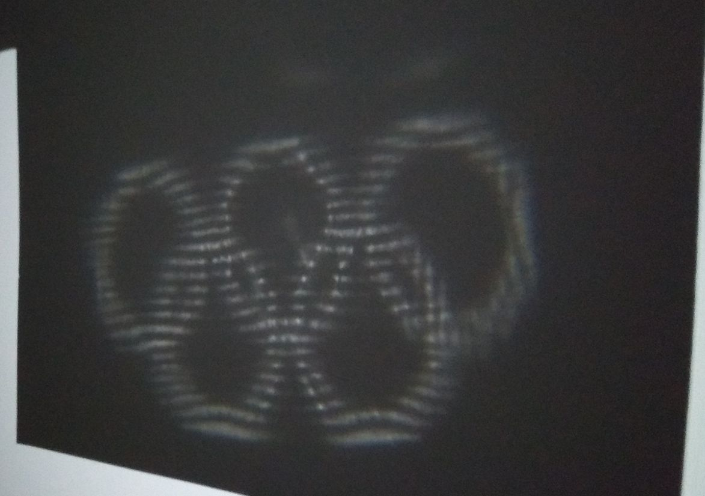

# Convex Caustics from Greyscale Images

This program takes a greyscale picture and computes a convex lens which projects the input image when lit by a point light source from behind.

## Explanation

The program performs three steps to compute a convex lens from a greyscale picture:

1. Derive a target distribution of surface normals (extended Gaussian image) from the greyscale image.
2. Optimise the shape of a convex polytope to match the target normal distribution using [4].
3. Transform the convex polytope from a half-space representation (H-description) into a vertex representation (V-description) and output the geometry to a file.

### Limitations

The method makes some simplifying assumptions and approximations. Among others:
- The light source is assumed to be directional. This causes each pixel of the image to appear as a dot in the projected image, rather than filling out the image when the lens is lit by a small light source like a phone flash.
- A simplified refraction calculation is used to compute the surface distribution that determines the shape. This leads to some warping of the final image.
- Fresnel reflectivity and second-order light interactions are ignored. This results in some minor stray lights.

## Build Instructions

Requirements:
- CMake
- GCC or Clang
- CGAL 4.10 or higher (tested up to version 6.0.1)

Install the requirements via vcpkg (instructions here: https://learn.microsoft.com/de-de/vcpkg/get_started/overview) with:

    vcpkg install cgal

Then simply build the repository with:

    mkdir build/
    cd build
    cmake ..
    cmake --build .

## Usage

Once built, the resulting binary can be used like this:

    ./convcaust input.pgm output.off

## Examples

The examples folder contains the result of an optimisation. The file `examples/olympic_rings/lens.stl` contains the mesh that was used to CNC mill the final lens out of acrylic. For fabrication, the model was inverted to create a negative imprint. Apart from that, only minor manual modifications were made to the geometry.

### Input

### Mesh

### Simulation

### Real Photo

## References

- [1] Piovarči, Michal, et al. "Directional screens." Proceedings of the 1st Annual ACM Symposium on Computational Fabrication. 2017.
- [2] Schwartzburg, Yuliy, et al. "High-contrast computational caustic design." ACM Transactions on Graphics (TOG) 33.4 (2014): 1-11.
- [3] Weyrich, Tim, et al. "Fabricating microgeometry for custom surface reflectance." ACM Transactions on Graphics (TOG) 28.3 (2009): 1-6.
- [4] Little, James J. "An iterative method for reconstructing convex polyhedra from extended Gaussian images." Proceedings of the Third AAAI Conference on Artificial Intelligence. 1983.

## Note

This is a partial rewrite of a university project completed in the summer semester of 2017 for the lecture "Computational Fabrication".
